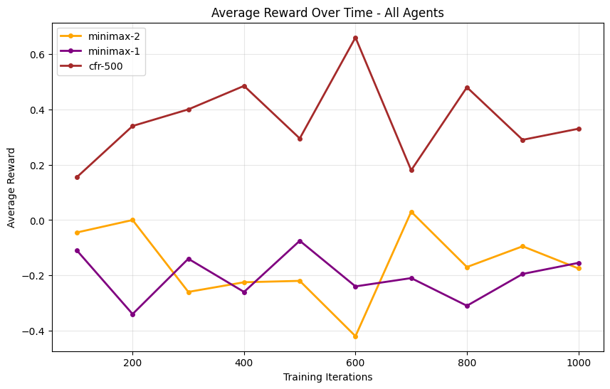

# Evaluación Experimental de Agentes CFR en Kuhn Poker de 2 y 3 Jugadores

## Introducción

El *Kuhn Poker* es un juego secuencial de información imperfecta ampliamente utilizado para investigar algoritmos de aprendizaje y teoría de juegos. En este trabajo analizamos el desempeño de agentes basados en *Counterfactual Regret Minimization* (CFR) frente a otros enfoques clásicos, como agentes *minimax* (búsqueda con profundidad limitada) y agentes aleatorios (*random*), en instancias de 2 y 3 jugadores.

El objetivo principal es observar cómo CFR converge hacia estrategias óptimas (equilibrio de Nash) y cómo se compara su rendimiento frente a agentes deterministas y aleatorios, así como el impacto de la posición de juego y la cantidad de entrenamiento.

### Descripción de los Agentes

- **CFR (`cfr-<n>`):** Utiliza el algoritmo *Counterfactual Regret Minimization* con `<n>` actualizaciones por paso de entrenamiento. A mayor número de actualizaciones, se espera una mejor aproximación al equilibrio de Nash.
- **Minimax (`minimax-
`):** Realiza búsqueda minimax con profundidad `p`. No modela adecuadamente la incertidumbre ni estrategias mixtas, por lo que se espera que tenga un rendimiento limitado en entornos de información imperfecta.
- **Random:** Juega completamente al azar. Sirve como línea base inferior esperada.

## Configuración Experimental

Se evaluaron partidas de Kuhn Poker para 2 y 3 jugadores, enfrentando agentes CFR contra minimax y random, y también en escenarios de autojuego CFR. Se variaron los parámetros de entrenamiento (número de actualizaciones) y la posición de los agentes para analizar su impacto.

Los resultados se presentan en gráficos que muestran:
1. **Recompensa promedio a lo largo del entrenamiento**
2. **Recompensa acumulada**
3. **Comparación de agentes por posición**
4. **Evidencia de convergencia y equilibrio**

## Resultados y Análisis

### 1. Comparación inicial: CFR vs Minimax y Random (2 jugadores)

#### 1.1 CFR vs Minimax 1

#### 1.1 CFR vs Minimax 2

#### 1.3 CFR vs Random

- `minimax-1` y `random` muestran recompensas promedio **negativas o cercanas a cero**, confirmando que no son competitivos contra CFR. Por otro lado, `minimax-2` se mantiene balanceado frente a `cfr-500`, con recompensas promedio cercanas a cero, aunque presenta algunos picos donde logra superponerse al CFR y, en ciertas ocasiones, termina con una ligera ventaja. Esto indica que puede igualar e incluso superar puntualmente el desempeño del agente CFR en este escenario.
- Esto sugiere que **CFR supera a agentes clásicos deterministas en juegos de información imperfecta cuando se enfrenta a oponentes básicos**, aunque para alcanzar su máximo potencial y estrategias cercanas al equilibrio de Nash, **requiere un mayor entrenamiento y número de iteraciones**.

### 2. Rendimiento acumulado y promedio (CFR vs Random)

- En juegos contra `random`, el agente `cfr-500` logra **ganancias acumuladas cercanas a 1000 fichas**, mientras que `random` incurre en pérdidas equivalentes.
- La **recompensa promedio por iteración** también evidencia esta diferencia, con `cfr-500` superando a `random` por un amplio margen (~0.5).
- Esto valida que **CFR no solo converge a estrategias óptimas, sino que también explota eficientemente oponentes subóptimos**.

### 3. CFR vs Minimax (2 jugadores)

- En partidas contra `minimax-1`, `cfr-500` sigue logrando **recompensas positivas y estables**, mientras que `minimax-1` obtiene valores negativos.
- Aunque `minimax-1` es más resistente que `random`, su rendimiento aún es claramente inferior.
- Esto refuerza la noción de que **minimax no es adecuado para juegos como Kuhn Poker**, donde la información oculta es clave.

### 4. CFR vs Minimax 1 vs Minimax 2

- En partidas entre `cfr-500`, `minimax-1` y `minimax-2`, se observa que:
  - `cfr-500` mantiene un **desempeño consistente** a lo largo del tiempo.
  - `minimax-2` puede igualar o superar puntualmente a CFR, pero **no logra sostener esa ventaja** y su rendimiento es menos estable.
  - `minimax-1` permanece con **recompensas negativas**, evidenciando su vulnerabilidad frente a estrategias más avanzadas.
- Estos resultados muestran que **CFR se adapta y explota las debilidades de los agentes deterministas**, mientras que la mayor profundidad de Minimax-2 le permite resistir mejor, aunque sin alcanzar la estabilidad y adaptabilidad de CFR.
- Se refuerza así la importancia de la **aleatoriedad y la capacidad de aprendizaje** en juegos de información imperfecta para aproximarse a estrategias de equilibrio.

### 5. CFR en 3 jugadores

- En el escenario con `cfr1-500`, `cfr2-500` y `cfr3-500`, se observa que:
  - `cfr2-500` y `cfr3-500` **alcanzan rendimientos promedio positivos**, con menor varianza.
  - `cfr1-500` sufre un **descenso progresivo** en su recompensa, cayendo a valores cercanos a -0.5.
- Este patrón sugiere que:
  - **La posición en el juego afecta significativamente el desempeño** de los agentes CFR.
  - **CFR2 y CFR3 parecen estar alcanzando un equilibrio mutuo**, ya que sus recompensas se estabilizan sin ventaja evidente.
- Este experimento muestra un **indicio de convergencia hacia un equilibrio de Nash parcial**, incluso en el entorno más complejo de tres jugadores.

## Conclusiones

1. **CFR logra superar a agentes básicos como minimax y random**, tanto en juegos de 2 como de 3 jugadores, incluso con un entrenamiento limitado.
2. **Minimax presenta limitaciones importantes** debido a su naturaleza determinista y suposiciones de información completa, lo que lo hace vulnerable frente a CFR en juegos de información imperfecta.
3. **La posición de juego influye significativamente**, siendo más difícil obtener buenas recompensas como primer jugador (CFR1).
4. En el caso de tres jugadores, se observa que **CFR2 y CFR3 tienden a converger hacia un equilibrio mutuo**, lo cual es consistente con la teoría de juego adaptativo y autojuego en CFR. Además, **CFR en el entorno de tres jugadores logra superar claramente a agentes minimax**.
5. **Para alcanzar estrategias cercanas al equilibrio de Nash y explotar completamente el potencial de CFR, se requiere un mayor número de iteraciones y entrenamiento más prolongado**.