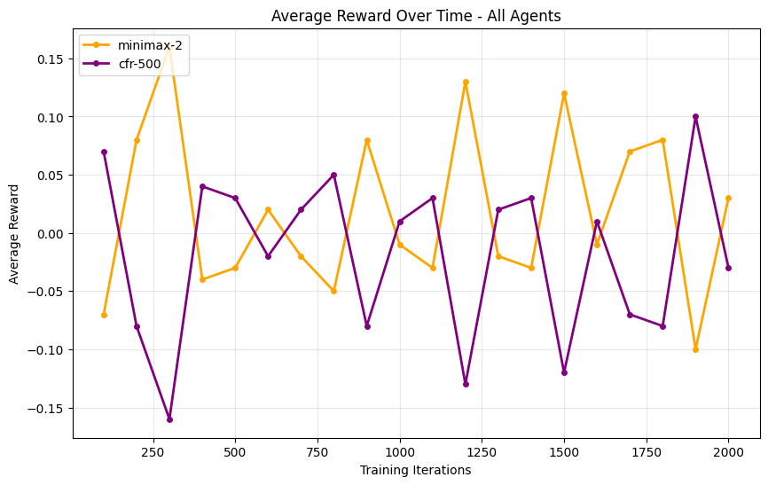
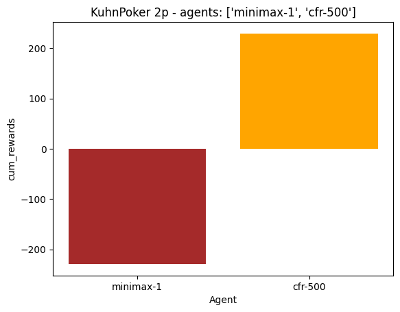

# JOINT REPORT
Juan Pedro da Silva ([Repo Github](https://github.com/JuanCommits/multiagents-2) con todo el código y experimentos.)

# Monte Carlo Tree Search vs. Minimax & Random Agents

## Introducción

Este informe presenta un análisis comparativo de diferentes estrategias de agentes en dos juegos de mesa clásicos: **Tic-Tac-Toe** y **Nocca-Nocca**. El foco principal está en evaluar el rendimiento del agente basado en **Monte Carlo Tree Search (MCTS)** frente a enfoques tradicionales como los agentes **Minimax** y **Random**. Los experimentos fueron diseñados para analizar cómo se comportan estos agentes bajo diversas configuraciones, prestando especial atención al impacto de los parámetros de MCTS como el número de *rollouts*, simulaciones y estrategias de selección de acciones.

### Descripción de los Juegos

- **Tic-Tac-Toe**: Un juego simple, determinista y de información perfecta, frecuentemente utilizado como referencia para evaluar estrategias de búsqueda.
- **Nocca-Nocca**: Un juego de tablero por turnos más complejo que introduce mayor profundidad y posibilidades estratégicas, siendo ideal para probar algoritmos de búsqueda avanzados.

### Agentes

- **Agente Aleatorio**: Selecciona movimientos de forma completamente aleatoria. Sirve como línea base para la comparación de rendimiento.
- **Agente Minimax**: Implementa el algoritmo clásico de minimax con profundidad de búsqueda configurable. Es óptimo para juegos deterministas con información perfecta.
- **Agente MCTS**: Usa simulaciones aleatorias para evaluar movimientos, con parámetros configurables:
  - **Rollouts**: Número de veces que se recorre el árbol por jugada.
  - **Simulaciones**: Número de partidas simuladas por *rollout*.
  - **Estrategia de selección de acción**: Define cómo el agente elige acciones desde el árbol de búsqueda (por ejemplo, valor máximo).

## Configuración Experimental

Los experimentos fueron definidos mediante un archivo JSON que especificaba:
- Los agentes a comparar
- Tipo de juego y sus parámetros
- Número de iteraciones y tamaño de lote
- Parámetros específicos de MCTS (*rollouts*, simulaciones, selección de acciones)

Los resultados se visualizaron en gráficos de cuatro paneles para cada experimento:
1. **Recompensas acumuladas a lo largo del tiempo**
2. **Victorias por lote de partidas**
3. **Promedio de movimientos por partida**
4. **Resumen de rendimiento general**

## Resultados

### 1. MCTS vs. Minimax (Tic-Tac-Toe)

_vs_minimax(3_depth).png)

- **Observación**: Minimax supera consistentemente a MCTS en recompensas acumuladas y partidas ganadas.
- **Interpretación**: En un juego simple y totalmente explorable como Tic-Tac-Toe, Minimax (con profundidad suficiente) es óptimo, mientras que MCTS tiene dificultades para igualar su rendimiento debido a su naturaleza estocástica y horizonte de búsqueda limitado.

### 2. MCTS vs. Aleatorio (Tic-Tac-Toe)

_vs_random.png)

- **Observación**: MCTS domina al agente aleatorio, logrando el máximo de victorias y recompensas posibles.
- **Interpretación**: Incluso con una cantidad moderada de *rollouts* y simulaciones, MCTS supera ampliamente a la estrategia aleatoria, demostrando su capacidad de aprender estrategias efectivas mediante simulación.

### 3. MCTS vs. MCTS (Parámetros diferentes, Tic-Tac-Toe)

_vs_mcts(10_rollouts,100_simulations).png)

- **Observación**: Aumentar la cantidad de simulaciones (aunque con menos *rollouts*) puede mejorar el rendimiento, como se observa en el agente con 5 *rollouts* y 200 simulaciones superando al de 10/100.
- **Interpretación**: El balance entre *rollouts* y simulaciones es crucial; más simulaciones por *rollout* pueden permitir una exploración más profunda, pero la configuración óptima depende del juego.

### 4. MCTS (500 simulaciones) vs. Minimax (Tic-Tac-Toe)

_vs_mcts(5_rollouts,500_simulations))

- **Observación**: Incluso con 500 simulaciones por jugada, MCTS no logra superar a Minimax en Tic-Tac-Toe. Minimax sigue ganando de forma consistente, lo que demuestra que 500 simulaciones no son suficientes para igualar la búsqueda exhaustiva de Minimax en un juego pequeño.
- **Interpretación**: Aumentar las simulaciones permite que MCTS se aproxime al juego óptimo, pero Minimax sigue siendo difícil de superar en juegos completamente explorables.

### 5. MCTS vs. Aleatorio (Nocca-Nocca)

_vs_random.png)

- **Observación**: MCTS supera consistentemente al agente aleatorio, como era de esperarse.
- **Interpretación**: La capacidad de MCTS de simular y evaluar estados futuros le otorga una ventaja considerable frente al juego aleatorio.

### 6. MCTS vs. Minimax (Nocca-Nocca)

_vs_minimax(2_depth).png)

- **Observación**: En Nocca-Nocca, MCTS puede superar a Minimax, especialmente cuando este está limitado en profundidad.
- **Interpretación**: La complejidad de Nocca-Nocca hace inviable una búsqueda exhaustiva para Minimax con baja profundidad, permitiendo que MCTS aproveche sus simulaciones para lograr mejor desempeño.

### 7. MCTS (200 Simulaciones) vs. Minimax (Nocca-Nocca)

_vs_minimax(2_depth).png)

- **Observación**: En Nocca-Nocca, aumentar las *simulaciones* a 200 otorga al agente MCTS una ventaja significativa frente a Minimax, especialmente cuando este está limitado por la profundidad de búsqueda.
- **Interpretación**: Más *simulaciones* permiten a MCTS explorar y evaluar mejor los posibles futuros, haciéndolo más robusto en juegos complejos donde Minimax está computacionalmente limitado.

### 8. MCTS vs. MCTS (Parámetros diferentes, Nocca-Nocca)

#### 8.1. Rollouts & Simulations
_vs_mcts(10_rollouts,100_simulations).png)

- **Observación**: Similar a Tic-Tac-Toe, el agente con más simulaciones por *rollout* tiende a tener mejor rendimiento.
- **Interpretación**: Ajustar los parámetros es esencial para maximizar el rendimiento de MCTS, especialmente en juegos más complejos.

#### 8.2. Max Value vs Max Count
_vs_mcts(5_rollouts,200_simulations)_max_value.png)

- **Observación**: Al comparar dos variantes de MCTS con los mismos parámetros de *rollouts* y simulaciones, pero diferentes estrategias de selección de acción (una elige la acción más visitada, *max count*, y la otra la de mayor valor promedio, *max value*), se observa que la estrategia *max value* obtiene consistentemente todas las victorias y recompensas positivas, mientras que *max count* pierde todas las partidas.
- **Interpretación**: En este entorno y configuración, seleccionar la acción por valor promedio (*max value*) resulta mucho más efectivo que simplemente elegir la más visitada (*max count*), ya que permite explotar mejor la información obtenida durante las simulaciones y evita sesgos por exploración excesiva.

## Impacto de los Parámetros de MCTS

- **Rollouts**: Más *rollouts* tienden a mejorar la exploración, pero pueden reducir la profundidad de cada simulación.
- **Simulaciones**: Más simulaciones por *rollout* permiten una evaluación más profunda de cada acción, lo que suele conducir a mejores decisiones.
- **Estrategia de selección de acción**: Los resultados muestran que seleccionar la acción por *mayor valor* (*max value*) puede ser significativamente superior a elegir la acción más visitada (*max count*), especialmente en configuraciones donde la exploración puede inducir a errores o sesgos. La elección de la estrategia de selección de acción tiene un impacto directo en el rendimiento final del agente MCTS.

## Conclusiones

La búsqueda Monte Carlo en árboles (MCTS) es un enfoque poderoso y flexible tanto para juegos simples como complejos. Aunque puede no superar a algoritmos deterministas como Minimax en juegos pequeños y completamente explorables (como Tic-Tac-Toe), MCTS sobresale en entornos más grandes o complejos donde la búsqueda exhaustiva no es práctica por la misma complejidad del juego.

El rendimiento de MCTS es altamente sensible a sus parámetros, y se requiere una afinación cuidadosa para obtener resultados óptimos. En general, MCTS representa una estrategia robusta para juegos generales, especialmente cuando el espacio de estados es demasiado amplio para métodos tradicionales.

En estos experimentos pudimos observar una tendencia que indica la mejora del rendimiento de MCTS al aumentar las **simulaciones** y usar la estrategia de selección de acción **max value**. 

# Evaluación Experimental de Agentes CFR en Kuhn Poker de 2 y 3 Jugadores

## Introducción

El *Kuhn Poker* es un juego secuencial de información imperfecta ampliamente utilizado para investigar algoritmos de aprendizaje y teoría de juegos. En este trabajo analizamos el desempeño de agentes basados en *Counterfactual Regret Minimization* (CFR) frente a otros enfoques clásicos, como agentes *minimax* (búsqueda con profundidad limitada) y agentes aleatorios (*random*), en instancias de 2 y 3 jugadores.

El objetivo principal es observar cómo CFR converge hacia estrategias óptimas (equilibrio de Nash) y cómo se compara su rendimiento frente a agentes deterministas y aleatorios, así como el impacto de la posición de juego y la cantidad de entrenamiento.

### Descripción de los Agentes

- **CFR (`cfr-<n>`):** Utiliza el algoritmo *Counterfactual Regret Minimization* con `<n>` actualizaciones por paso de entrenamiento. A mayor número de actualizaciones, se espera una mejor aproximación al equilibrio de Nash.
- **Minimax (`minimax-
`):** Realiza búsqueda minimax con profundidad `p`. No modela adecuadamente la incertidumbre ni estrategias mixtas, por lo que se espera que tenga un rendimiento limitado en entornos de información imperfecta.
- **Random:** Juega completamente al azar. Sirve como línea base inferior esperada.

## Configuración Experimental

Se evaluaron partidas de Kuhn Poker para 2 y 3 jugadores, enfrentando agentes CFR contra minimax y random, y también en escenarios de autojuego CFR. Se variaron los parámetros de entrenamiento (número de actualizaciones) y la posición de los agentes para analizar su impacto.

Los resultados se presentan en gráficos que muestran:
1. **Recompensa promedio a lo largo del entrenamiento**
2. **Recompensa acumulada**
3. **Comparación de agentes por posición**
4. **Evidencia de convergencia y equilibrio**

## Resultados y Análisis

### 1. Comparación inicial: CFR vs Minimax y Random (2 jugadores)

#### 1.1 CFR vs Minimax 1

#### 1.1 CFR vs Minimax 2

#### 1.3 CFR vs Random

- `minimax-1` y `random` muestran recompensas promedio **negativas o cercanas a cero**, confirmando que no son competitivos contra CFR. Por otro lado, `minimax-2` se mantiene balanceado frente a `cfr-500`, con recompensas promedio cercanas a cero, aunque presenta algunos picos donde logra superponerse al CFR y, en ciertas ocasiones, termina con una ligera ventaja. Esto indica que puede igualar e incluso superar puntualmente el desempeño del agente CFR en este escenario.
- Esto sugiere que **CFR supera a agentes clásicos deterministas en juegos de información imperfecta cuando se enfrenta a oponentes básicos**, aunque para alcanzar su máximo potencial y estrategias cercanas al equilibrio de Nash, **requiere un mayor entrenamiento y número de iteraciones**.

### 2. Rendimiento acumulado y promedio (CFR vs Random)

- En juegos contra `random`, el agente `cfr-500` logra **ganancias acumuladas cercanas a 1000 fichas**, mientras que `random` incurre en pérdidas equivalentes.
- La **recompensa promedio por iteración** también evidencia esta diferencia, con `cfr-500` superando a `random` por un amplio margen (~0.5).
- Esto valida que **CFR no solo converge a estrategias óptimas, sino que también explota eficientemente oponentes subóptimos**.

### 3. CFR vs Minimax (2 jugadores)

- En partidas contra `minimax-1`, `cfr-500` sigue logrando **recompensas positivas y estables**, mientras que `minimax-1` obtiene valores negativos.
- Aunque `minimax-1` es más resistente que `random`, su rendimiento aún es claramente inferior.
- Esto refuerza la noción de que **minimax no es adecuado para juegos como Kuhn Poker**, donde la información oculta es clave.

### 4. CFR vs Minimax 1 vs Minimax 2

- En partidas entre `cfr-500`, `minimax-1` y `minimax-2`, se observa que:
  - `cfr-500` mantiene un **desempeño consistente** a lo largo del tiempo.
  - `minimax-2` puede igualar o superar puntualmente a CFR, pero **no logra sostener esa ventaja** y su rendimiento es menos estable.
  - `minimax-1` permanece con **recompensas negativas**, evidenciando su vulnerabilidad frente a estrategias más avanzadas.
- Estos resultados muestran que **CFR se adapta y explota las debilidades de los agentes deterministas**, mientras que la mayor profundidad de Minimax-2 le permite resistir mejor, aunque sin alcanzar la estabilidad y adaptabilidad de CFR.
- Se refuerza así la importancia de la **aleatoriedad y la capacidad de aprendizaje** en juegos de información imperfecta para aproximarse a estrategias de equilibrio.

### 5. CFR en 3 jugadores

- En el escenario con `cfr1-500`, `cfr2-500` y `cfr3-500`, se observa que:
  - `cfr2-500` y `cfr3-500` **alcanzan rendimientos promedio positivos**, con menor varianza.
  - `cfr1-500` sufre un **descenso progresivo** en su recompensa, cayendo a valores cercanos a -0.5.
- Este patrón sugiere que:
  - **La posición en el juego afecta significativamente el desempeño** de los agentes CFR.
  - **CFR2 y CFR3 parecen estar alcanzando un equilibrio mutuo**, ya que sus recompensas se estabilizan sin ventaja evidente.
- Este experimento muestra un **indicio de convergencia hacia un equilibrio de Nash parcial**, incluso en el entorno más complejo de tres jugadores.

## Conclusiones

1. **CFR logra superar a agentes básicos como minimax y random**, tanto en juegos de 2 como de 3 jugadores, incluso con un entrenamiento limitado.
2. **Minimax presenta limitaciones importantes** debido a su naturaleza determinista y suposiciones de información completa, lo que lo hace vulnerable frente a CFR en juegos de información imperfecta.
3. **La posición de juego influye significativamente**, siendo más difícil obtener buenas recompensas como primer jugador (CFR1).
4. En el caso de tres jugadores, se observa que **CFR2 y CFR3 tienden a converger hacia un equilibrio**, lo cual es consistente con la teoría y autojuego en CFR. Además, **CFR en el entorno de tres jugadores logra superar claramente a agentes minimax** mostrando su rendimiento en juegos de información incompleta.
5. **Para alcanzar estrategias cercanas al equilibrio de Nash y explotar completamente el potencial de CFR, se requiere un mayor número de iteraciones y entrenamiento más prolongado**.